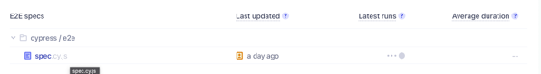

# Cypress
Cypress is a purely JavaScript-based front-end testing tool built for the modern web. 

It aims to address the pain points developers or QA engineers face while testing an application. 

Cypress is a more developer-friendly tool that uses a unique DOM manipulation technique and operates directly in the browser. 

Cypress also provides a unique interactive test runner in which it executes all commands.

## Installation

cd to your project directory
```bash
cd /project/path
```
run npm install
```bash
npm install
```
open cypress
```bash
npx cypress open
```

If this doesn't work you can download the application from their website - https://download.cypress.io/desktop

Then in the UI, click on the spec you want to run and this will run it


## Usage

```python
# returns elements with css selectors
cy.get("[id=check-details]")

# clicks elements
cy.get("[id=check-details]").click()

# checks text of element
cy.get("[id=check-details]").contains(expected);

# group & label tests + manage context & hooks
describe('test suite name', () => {

# label a test block
it('Given I visit homepage', () => {

# inject aXe - https://github.com/component-driven/cypress-axe
cy.injectAxe()
cy.checkA11y()

# Type into text box
cy.get("[id=check-details]").type("text");

# select from drop down
cy.get("[id=check-details]").select("dropdown text");

```


## Gotchas

If you get the below error when running ```npm install```

```
npm ERR! [FAILED] The Cypress App could not be downloaded.
npm ERR! [FAILED]
npm ERR! [FAILED] Does your workplace require a proxy to be used to access the Internet? If so, you must configure the HTTP_PROXY environment variable before downloading Cypress. Read more: https://on.cypress.io/proxy-configuration
npm ERR! [FAILED]
npm ERR! [FAILED] Otherwise, please check network connectivity and try again:
```

Then run ```export HTTP_PROXY=http://my-company-proxy.com```

And try ```npm install``` again
